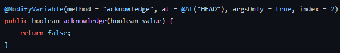

# Note: Please do not harass anyone who are on the development teams or are signed to NDAs.

# 1.19.84
Minecraft has recently released the 1.19.1 version of Minecraft, and to be honest, I could really care less about it, 
except for this one feature that really kills the entire update. Yes, you know it and love it, chat reports! 

And no, you can't remove it because you migrated your Minecraft account to a Microsoft account. You just fell for the
Microsoft trap. 

## A. Why is this such a big deal? 
Well, four main reasons. 

### 1. Microsoft/Mojang's inability to listen to the community for feedback
Like seriously, this is outrageous, considering the fact that the community absolutely despises this. This, and another point below
is the exact reason why the community is going haywires, and at this point, you're shooting yourself in the foot big time.

We know this because of what you did to Bedrock, and the stupid filters that exist on there. Like, you can get censored for saying,
get this, Japan, Pakistan, night. **night**. **NIGHT**. I am confident to say that whoever is working on the chat filters for 
Bedrock edition is an absolute genius for blacklisting everyone from saying night. They must really hate nights in general, because
that is ludicrous.

### 2. Shady practices that's been occuring behind the scenes. 
More is linked [here](https://saveminecraft.org/leaks).

I feel like this is just messed up in general. Mojang is practically paying people to turn a blind eye, especially big 
plugin creators, and that's pretty huge considering they probably operate half of the plugins you use in your server.
You shouldn't go harass these people, although I hpope they know that they're supporting a lost cause, and this removes
freedom that we otherwise had in 1.19. 

Here are some of my points against some of their messages:
* I don't agree with most of their points, primarily because each communities have their own purposes. You can't judge solely
on just a few communities. 

* I also cannot trust Microsoft themselves. Remember snooper settings? Remember how they were implemented, and how they basically
violated GDPR guidelines, so mojang removed them in 1.13? Remembered how they reimplemented them in a later version that violated
the GDPR guidelines even further? This is the prime example of why we cannot trust Mojang and their ridiculous anticts. It is just 
the same action over and over again, and they never listen to us, just stay radio silent, just hoping all of the criticism blows over.

* Practically paying people won't do anything to subside the criticism. You can't just give a gun to a bear, just to kill a rat. 
That's just going to cause more outrage in general. I wouldn't be surprised if all criticism just keeps going for another year,
especially with more invasive tactics. (cough cough snooper settings cough cough not being able to toggle it)

Some of these creations include:

* SpigotMC
* EssentialX
* ViaVersion
* (Maybe) PaperMC

There are some alternatives though. You could use either Fabric or Quilt to develop your server, which gives you more possibilities
in general. 

I encourage that you try your best to boycott these plugins in solidarity to showing your support against this specific 
update. Them signing NDA's is especially shady, considering that they make some of the plugins that you use in your servers.

### 3. Mojang's inability.
You can practically remove context with one mixin. That's saying a lot, considering the fact that Microsoft, a multi-billion
dollar corporation probably spewed millions of dollars, just to have it be pointless due to ONE MIXIN.

### 4. Mojang wasting unnecessary resources
This is a pretty big point, considering the fact that Mojang is going to waste, possibly, **MILLIONS** of dollars just 
trying to ban all of the edgy kids. Remember that alt shops exist, so you're basically promoting their business **INDIRECTLY**,
which is just hilarious. You've indirectly caused a more prevalent issue to circulate, rather than solve a single issue. 

## B. What can Mojang do? 
Realistically, what most people want is one thing and only one thing, the complete removal of the entire chat reporting 
feature. It's a stupid idea, and it's definitely for stupid people to exploit. Play stupid games, win stupid prizes. 

Another alternative is to tone down the punishments. Being edgy on one server shouldn't constitute to an entire ban globally.
That's just being irrational in general. Like, what if I talk about drinking soju (A form of alcohol in Korea) in one server, but
I talk about flowers in another? Should I get banned? No? Well you have a functioning brain, and yes, I shouldn't get banned. 
You should only get server banned, and besides, server moderators already enforce this, so there is literally no point. 

## C. What can I do?
Realistically, you can do the following in order to tell Mojang to screw off with their terrible decision making.

### 1C. Users
The best you can do is not play on any server that allows chat reporting. However, if you want to play on these servers,
I highly recommend that you strip all context, so nobody can report you for something stupid. I mean, it is Microsoft, 
so I wouldn't even be remotely surprised. 

Here are some mods if you want to get rid of these pests:
* [No Chat Report - Removes all cryptographic keys so chats can't be traced back to you](https://github.com/Aizistral-Studios/No-Chat-Reports)
* [Guardian - Strips all context from reporting](https://github.com/nodusclient/guardian)

These two mods are specific to Fabric (and Quilt and Forge I think), so no need to worry about whether or not you are on
the right platform for the mod.

### 2C. Server Owners
I highly recommend that you turn off **ANY** chat reporting features, as it's solely up to you to handle bans, not Microsoft or 
Mojang. If you fear that it doesn't work, fear not, because there are specific plugins that should help with blocking all
chat reporting features. 

### 3C. Mod/Plugin Developers
Mod/Plugin developers aren't primarily effected by this, but your users are. Make sure to inform your users about 1.19.1, and make sure
they download the necessary mods in order to be safe out there. They shouldn't have to suffer because of poor decision making on
Mojang's part.

I'll say this again, not all people should be dictated by a group's actions. Just because someone is slightly edgy doesn't
mean they should get banned on **ALL** servers. That's just beyond ridiculous. I can understand individual servers, but global
bans are just too far in general. 

Fuck you Microsoft, Mojang, and anyone that is abiding to the NDA. You people disgust me.
